# The Merry Hackmas Card Creator


## Description

Created by [The North Pole Nodes](https://kpetrauskas92.github.io/team9-hackathon-december/about-us.html) as part of [Code Institute's December 2023 Hackathon](https://hackathon.codeinstitute.net/hackathon/40/), **The Merry Hackmas Card Creator** allows Users to generate personalized Christmas cards with customizable features, including the recipients name and choosing a variety of images and audio. 

<div style="display: flex; justify-content: center;">
  
</div>

<strong><a href="https://kpetrauskas92.github.io/team9-hackathon-december.html">Click Here</a></strong> to see the deployed website.

## [Contents](#contents)

- **[Features](#features)**
- **[Getting Started](#getting-started)**
- **[Agile Development and User Stories](#agile-development-and-user-stories)**
- **[UX and UI Design](#uxui-design)**
  - [UX](#ux)
  - [UI](#ui)
  - [Typography](typography)
  - [Color Palette](color-palette)

  - [Prerequisites](#prerequisites)
  - [Installation](#installation)
- **[Usage](#usage)**
  - [Customization](#customization)
- **[Deployment](#deployment)**
- **[Testing](#testing)**
- **[Technologies Used](#technologies-used)**
- **[Acknowledgements](#acknowledgements)**
- **[Credits](#credits)**

## [Features](#features)

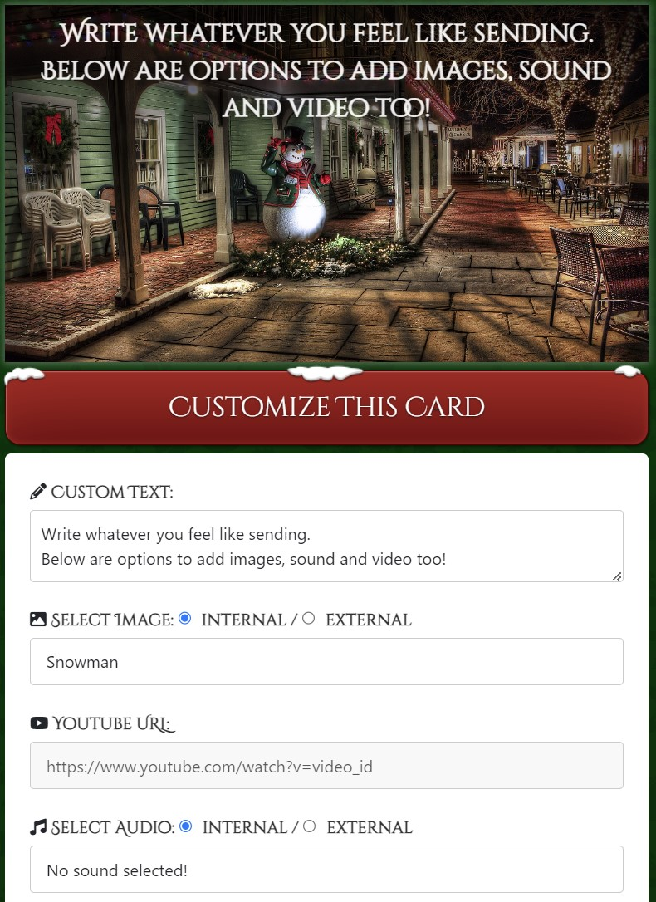

The main features include:
- **Name Customization:** Users can personalize their Christmas card by adding the recipient's name.
- **Image Selection:** Choose from a variety of festive images to accompany the card.
- **Audio Options:** Add holiday tunes or personalized messages with audio customization.


## [Getting Started](#getting-started)

### Prerequisites

Before you begin, make sure you have the following installed:

- [Node.js](https://nodejs.org/): The project is built using Node.js.
- [npm](https://www.npmjs.com/): The Node.js package manager, used to install project dependencies.
- [Web browser](https://www.google.com/chrome/): A modern web browser to view and interact with the Christmas card.

### Installation

1. **Clone the repository to your local machine:**

    ```bash
    git clone https://github.com/your-username/team9-hackathon-december.git
    ```

2. **Navigate to the project directory:**

    ```bash
    cd team9-hackathon-december
    ```

3. **Install project dependencies using npm:**

    ```bash
    npm install
    ```

### [Agile Development and User Stories](#agile-development-and-user-stories)

- [GitHubProjects](https://github.com/users/kpetrauskas92/projects/8)

  - 


### [UX and UI Design](#uxui-design)

  - [UX](#ux)

    - Wireframe Mock-ups used in developing the concept includeded the following examples:

      - 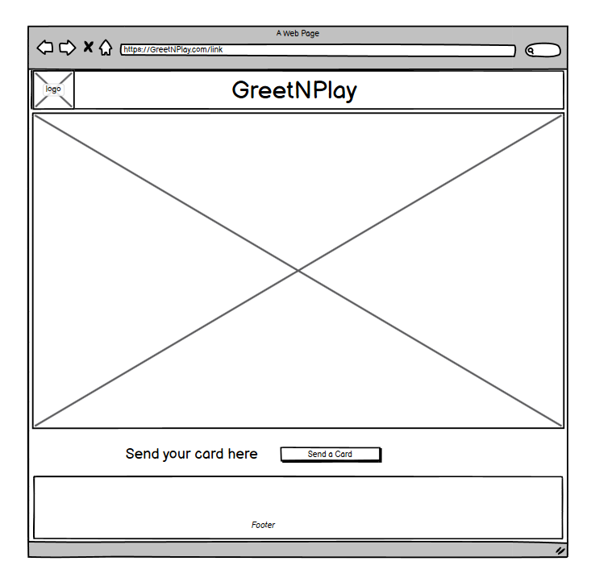
      - 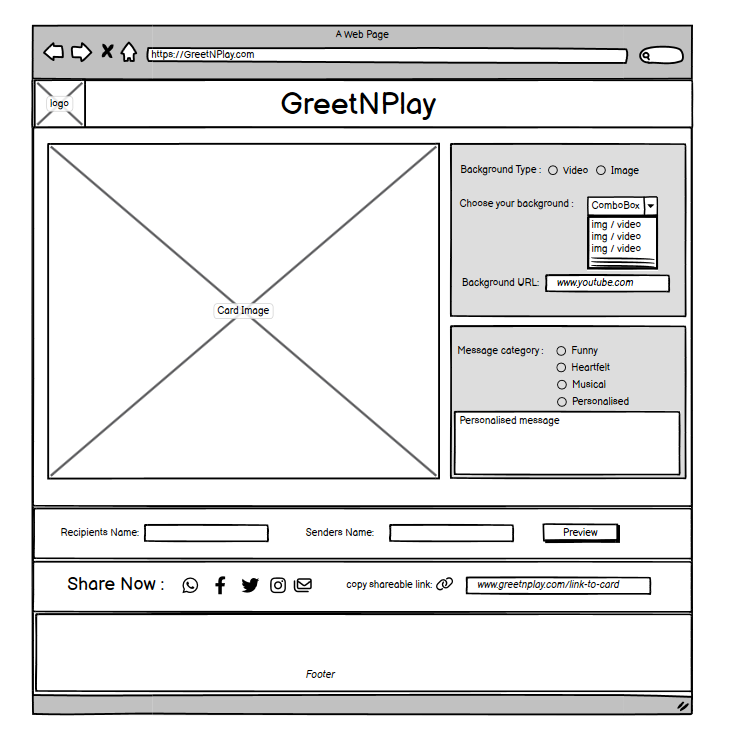

      - 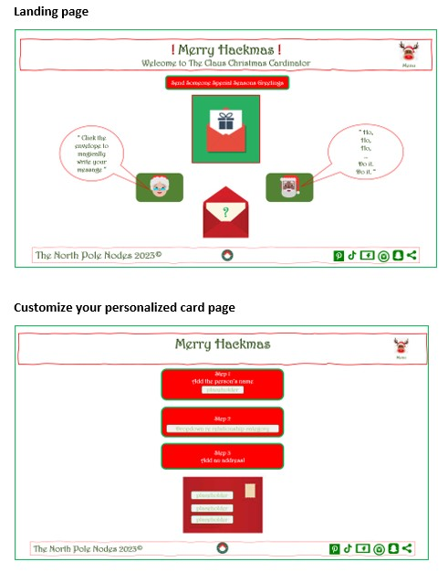)


  - [UI](#ui)
    - 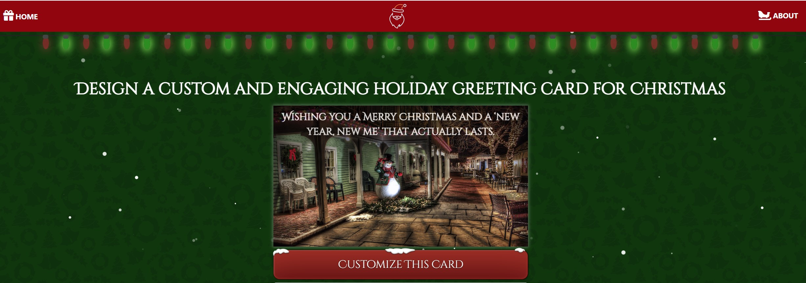

     1. **Navigation Bar:**
        - Located at the top of the page, the navigation bar includes links to different sections of the application, such as the home page and the about us page.

    2. **Customization Button:**
        - A prominent "Customize This Card" button triggers the customization section, allowing users to personalize their Christmas card.

    3. **Main Content Section:**
        - Divided into several key components:
        - **Heading:** Presents the main purpose of the application with a welcoming message.
        - **Image Container:** Displays the selected or default image for the Christmas card.
        - **Button to Trigger Collapse:** Allows users to expand or collapse the customization options.
        - **Customization Options:** Sections for adding text, choosing images, embedding YouTube videos, and selecting background music.

    4. **Text and Image Customization:**
     - **Text Section:** Allows users to input personalized text for their Christmas card.
     - **Choose Image Section:** A dropdown menu to select predefined images or an input box for an external image URL.

    5. **Media Embedding:**
     - **YouTube Video URL:** Users can input a YouTube video URL to embed a video in the Christmas card.
     - **Audio Selection:** Dropdown menu to choose background music for the card. Option to provide an external audio URL.

    6. **Audio Preview:**
     - An audio player with controls to preview the selected background music before finalizing the card.

    7. **Share Card Section:**
     - **Sender and Receiver Names:** Input fields for the sender's and receiver's names.
     - **Social Media Icons:** Buttons to share the card on popular social media platforms.
     - **Copy Link Button:** Allows users to copy a shareable URL for their personalized Christmas card.

    8. **Footer:**
     - Displays essential information such as copyright details and a link to the About Us page.

    9. **About Us Link:**
     - Clickable link in the footer that directs users to the "About Us" section, providing details about the team behind the Christmas card application.

    10. **Copy Link Script:**
     - JavaScript function for copying the shareable link to the clipboard.


### [Typography](typography)
- The main font used in this project is 'Cinzel Decorative. This font was chosen becuase of it's instantly reconizable Christmas theme and the familiar feeling associated with Christmas it evokes.

  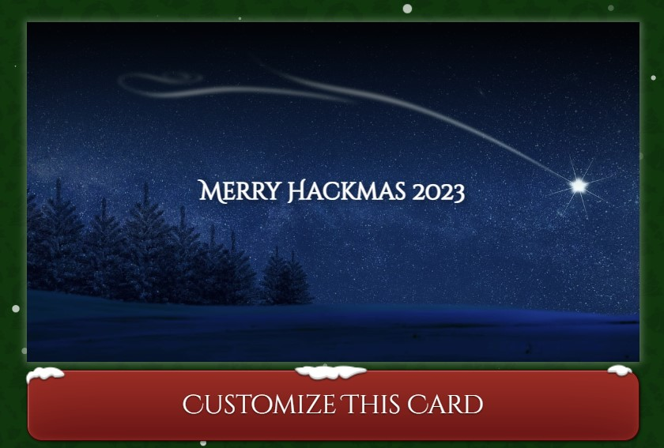


### [Color Palette](color-palette)
  
  The specific color scheme used in this project was selected based on balancing two main criteria. On the one hand, to create a uniquely engaging, appealing, user-friendly interface while simultaneoulsy staying within widely recognized visual themes most associated with Christmas.

The most important colors to the project's branding for consistency are below

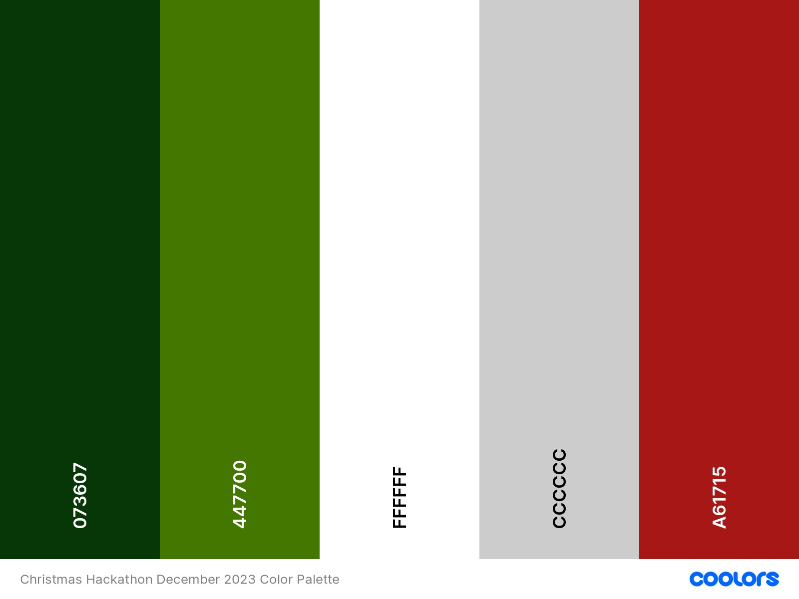

Below is a full list of colors used and their usage:

- Body Background Color:

  - Hex Code: #073607 (dark green)

- Navigation Bar Background Color:

  - Hex Code: #980505 (dark red)

- Text Color:

  - Hex Code: #ffffff (white)

- Input Fields and Borders Color:

  - Hex Code: #ccc (light gray)

- Accent Color for Focus:

  - Hex Code: #980505 (dark red)

- Button Background Color:

  - Hex Code: #5e0d0c (dark red)

- Button Text Color:

  - Hex Code: #FFF (white)

- Button Hover Background Color:

  - Hex Code: #a61715 (slightly lighter/darker red)

- Snowflake Color:

  - Linear Gradient: white to white (creating a light-colored circle)

- Overlay Gradient Color:

- Linear Gradient: 

  - rgba(0, 0, 0, 0.911) to rgba(0, 0, 0, 0) (creating a dark overlay for image captions)

- Social Icons Color:

  - Hex Code: #980505 (dark red)


- **[Deployment](#deployment)**


- **[Testing](#testing)**

   - Performance
     - Mobile
     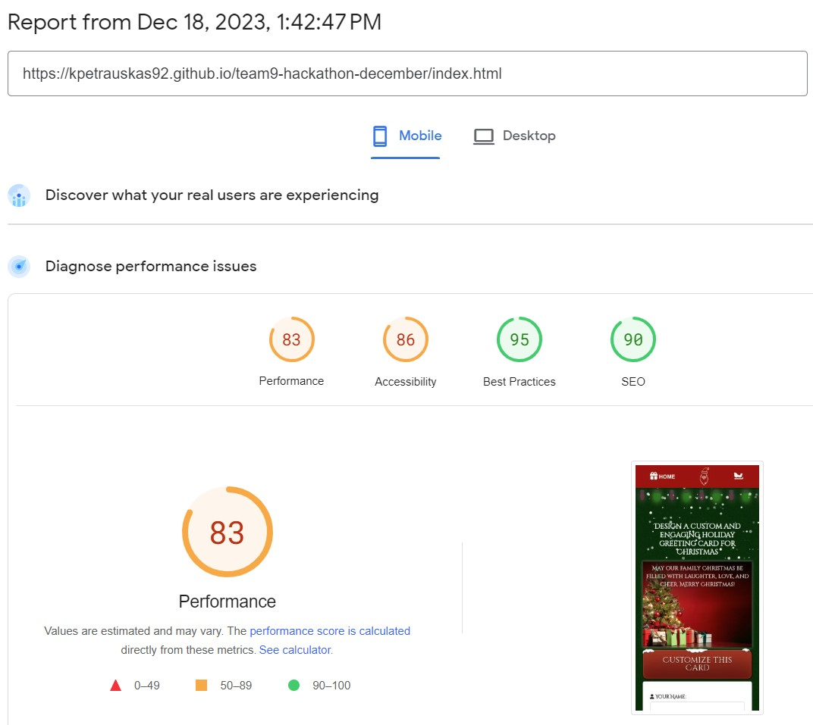
    
     - Desktop
     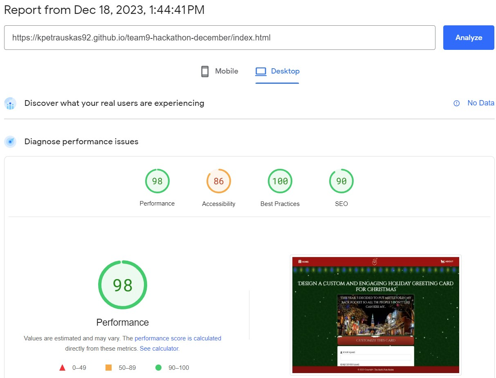

  - Accesibility 
    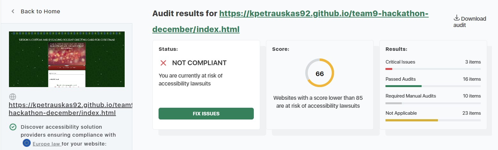


 - HTML
   - Mobile
     - X
   - Desktop
      -Y
 - CSS
    - Mobile
     - X
   - Desktop
      -Y

 - JavaScript
    - Mobile
     - X
   - Desktop
      -Y

 ### Bugs
   - Whitespace was found regarding specific icons on the about-us.html page
    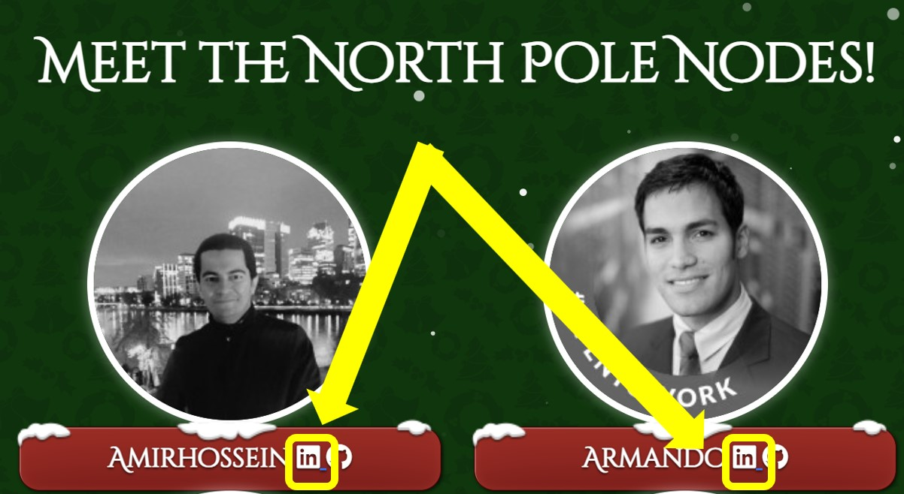

    - Y
    - Z


## [Technologies Used](#technologies-used)

- [Bootstrap](https://getbootstrap.com/). Used for styling and layout.
- [JQuery](https://jquery.com/). Enhances the interactivity and dynamic features.
- [Fontawesome](https://fontawesome.com/). Provides a collection of scalable vector icons.
- [Coolers.com](https://coolers.co). Generates color pallettes.
- [Snow.js](https://www.cssscript.com/configurable-snow-falling-effects-javascript-snow-js/). Configures snow falling effects in JavaScript

## [Acknowledgements](#acknowledgements)

- [CSS Christmas Lights]().
- Team logo design found at [redbubble](https://www.redbubble.com/i/kids-t-shirt/Node-JS-JavaScript-Ugly-Sweater-Christmas-by-vladocar/28588671.VXRIW).
- [pixabay](https://pixabay.com/).
- [PageSpeed Insights](https://pagespeed.web.dev/) was used to test the site's performance.


## [Credits](#credits)

### The North Pole Nodes
    


&#x2744; [Amirhossein](https://www.linkedin.com/in/pkarolisdev/)

&#x2744; [Armando](https://www.linkedin.com/in/armandourquiola/)

&#x2744; [Karolis](https://www.linkedin.com/in/pkarolisdev/)

&#x2744; [Sam](https://www.linkedin.com/in/sam-o-brien-olinger-b658283a/)

&#x2744; [Taher](https://www.linkedin.com/in/taher-m/)

&#x2744; Also see the **[About us](https://kpetrauskas92.github.io/team9-hackathon-december/about-us.html)** page.

<p align="center">
  **Click Here to go back to [Contents](#contents)**
</P>