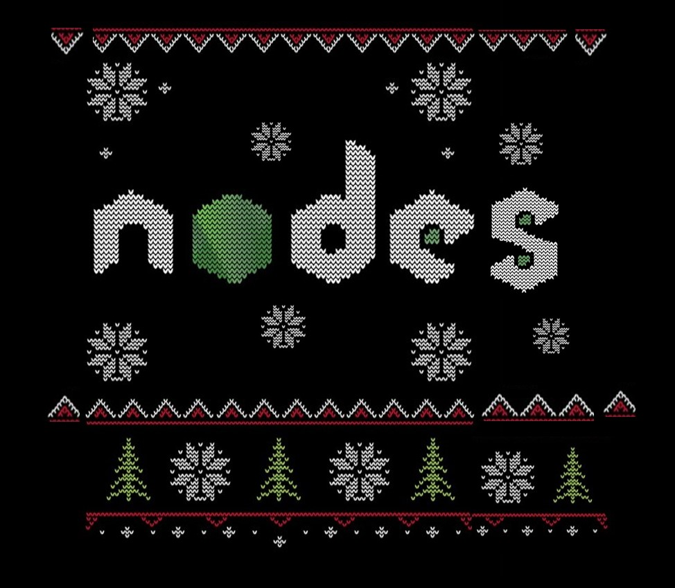

# The Merry Hackmas Card Creator


## Description

<p align="center">
  The Merry Hackmas Card Creator is a project that allows users to generate personalized Christmas cards with customizable features, including the recipients name and choosing a variety of images and audio.
</P>

<p align="center">
  
</p>

# Credits

<p align="center">
  <strong><a href="https://teman67.github.io/team9-hackathon-december">Click Here</a></strong> to see the deployed website.
</p>


## [Contents](#contents)

- **[Features](#features)**
- **[Agile Development and User Stories](#agile-development-and-user-stories)**
- **[UX and UI Design](#uxui-design)**
  - [UX](#ux)
  - [UI](#ui)
  - [Typography](typography)
  - [Color Pallette](color-pallette)
- **[Getting Started](#getting-started)**
  - [Prerequisites](#prerequisites)
  - [Installation](#installation)
- **[Usage](#usage)**
  - [Customization](#customization)
- **[Deployment](#deployment)**
- **[Testing](#testing)**
- **[Technologies Used](#technologies-used)**
- **[Credits](#credits)**
- **[License](#license)**

## [Features](#features)

- **Name Customization:** Users can personalize their Christmas card by adding the recipient's name.
- **Image Selection:** Choose from a variety of festive images to accompany the card.
- **Audio Options:** Add holiday tunes or personalized messages with audio customization.

### [Agile Development and User Stories](#agile-development-and-user-stories)

- [GitHubProjects](https://github.com/users/kpetrauskas92/projects/8)

  - 


### [UX and UI Design](#uxui-design)

  - [UX](#ux)

    - Wireframe Mock-ups

      - 
      - 

      - )


  - [UI](#ui)
    - 

### [Typography](typography)
- The font used in this project was chosen becuase of it's instantly reconizable and familar feel associated with Christmas.  


### [Color Pallette](color-pallette)
  
-  The specific color scheme used in this project was selected based on balancing two main criteria. On the one hand, to create a uniquely engaging, appealing, user-friendly interface while simultaneoulsy staying within widely recognized visual themes most associated with Christmas.

   - Color 1
   - Color 2
   - Color 3

## Getting Started

### Prerequisites

Before you begin, make sure you have the following installed:

- [Node.js](https://nodejs.org/): The project is built using Node.js.
- [npm](https://www.npmjs.com/): The Node.js package manager, used to install project dependencies.
- [Web browser](https://www.google.com/chrome/): A modern web browser to view and interact with the Christmas card.

### Installation

1. **Clone the repository to your local machine:**

    ```bash
    git clone https://github.com/your-username/team9-hackathon-december.git
    ```

2. **Navigate to the project directory:**

    ```bash
    cd team9-hackathon-december
    ```

3. **Install project dependencies using npm:**

    ```bash
    npm install
    ```

## Technologies Used

- [Bootstrap](https://getbootstrap.com/): Used for styling and layout.
- [JQuery](https://jquery.com/): Enhances the interactivity and dynamic features.
- [Fontawesome](https://fontawesome.com/): Provides a collection of scalable vector icons.


## [Credits](#credits)

### The North Pole Nodes
    



&#x2744; [Amirhossein](https://www.linkedin.com/in/pkarolisdev/)

&#x2744; [Armando](https://www.linkedin.com/in/armandourquiola/)

&#x2744; [Karolis](https://www.linkedin.com/in/pkarolisdev/)

&#x2744; [Sam](https://www.linkedin.com/in/sam-o-brien-olinger-b658283a/)

&#x2744; [Taher](https://www.linkedin.com/in/taher-m/)

&#x2744; Also see the **[About us](https://teman67.github.io/team9-hackathon-december/about-us.html)** page.


**Click Here to go back to [Contents](#contents)**
